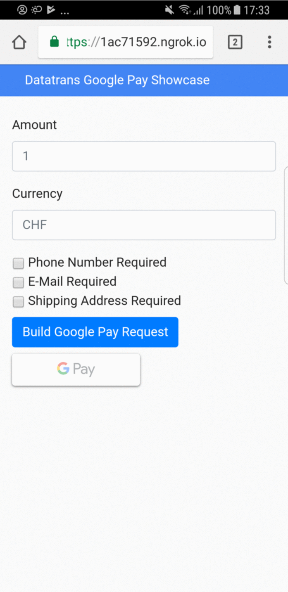

# Google Pay Web Sample App
Sample project that shows how to integrate Google Pay with Datatrans

## Getting Started

Google Pay allows merchants to collect payments with the Payment Request API. It enables merchants to receive encrypted payment information which can be forwarded to their Payment Processor. This Guide is intended for merchants who would like to integrate Google Pay with Datatrans. For more Information on Google Pay visit: https://pay.google.com/about/

(Optional) Please also read the Google Pay Guide for Developers to understand flows and technology: 
- [Overview](https://developers.google.com/pay/api/)
- [Guide for the Web](https://developers.google.com/pay/api/web/setup)

### Prerequisites

1. Java installed on your local dev system
2. Maven installed on your local dev system
3. Google Chrome, Mozilla Firefox, Apple Safari, or UCWeb UC Browser
4. A google account that has a payment method installed (https://support.google.com/payments/answer/6220309)
5. Some basic experience with Spring Boot
6. Some understanding of Google Pay and Payment Request API

### Sample Application Flow

This sample application demonstrates following parts of collecting a payment with Google Pay. 

1. Determine if the browser can use Google Pay and if there are payment methods available.
2. If so create a payment request object
3. Populate the payment request
4. Request payment from the user
5. Forward the encrypted payment data to the "back-end"
6. Create an XML request to authorize the transaction with Datatrans
7. Forward the Google Pay data with the XML request to the Datatrans XML API
8. Display the results. 

### Installing

1. Clone the repository
 ```zsh
    $ git clone git@github.com:datatrans/google-pay-web-sample.git
    $ cd google-pay-web-sample
```
2. Open it with your favorite IDE / text editor
3. Install the project

```
mvn clean install
```

## Running the app
This sample app uses Spring Boot and Embedded Tomcat. The server is listening on port 8080. 

To run the app execute the main class GooglepayApplication.java. 

Open http://localhost:8080/ in Google Chrome.

### Testing the app

Google Pay can be tested using any supported web browser: Google Chrome, Mozilla Firefox, Apple Safari, Opera, or UCWeb UC Browser on a PC or mobile device. However if you need to make this web app available for your mobile device, a tool to expose your local webserver through a public URL is for example Ngrok. [Ngrok](https://ngrok.com/). 

## Testing

1. Open the URL you defined in your browser.
2. Fill the inputs and tap/click Build Google Pay Request
3. Click the Google Pay button that has been enabled
4. Select your payment method (omitted in Screenshots due to security policies)
5. Result is displayed



On your Android device / Google account it's easiest if you just configure a real credit card. Authorizations whith real cards will be declined on the Datatrans test system (https://admin.sandbox.datatrans.com/). So don't worry, your card will not be charged. In order to get some successful transactions Datatrans has the following logic in place (only on the test system obviously):

If a valid Google Pay token is sent we do the following replacements:

cardno=4242 4242 4242 4242
expm=12
expy=18


### Authorization with Datatrans
Check out `src/main/java/ch/datatrans/examples/googlepay/client/DatatransClient.java` to see how the authorization is done.

Sample request:

```XML
<?xml version="1.0" encoding="UTF-8" ?>
<authorizationService version="1">
  <body merchantId="$merchantId">
    <transaction refno="$refno">
      <request>
        <googlePayData><![CDATA[$token]]></googlePayData>
        <reqtype>NOA</reqtype>
        <transtype>05</transtype>
        <sign>$sign</sign>
      </request>
    </transaction>
  </body>
</authorizationService>
```

Sample response:

```XML
<?xml version="1.0" encoding="UTF-8" ?>
<authorizationService version="1">
  <body merchantId="$merchantId" status="accepted">
    <transaction refno="$refno" trxStatus="response">
      <request>
        <googlePayData><![CDATA[$token]]></googlePayData>
        <reqtype>NOA</reqtype>
        <transtype>05</transtype>
        <sign>$sign</sign>
      </request>
      <response>
        <responseCode>01</responseCode>
        <responseMessage>Authorized</responseMessage>
        <uppTransactionId>160823101329060450</uppTrasactionId>
        <authorizationCode>538050451</authorizationCode>
        <acqAuthorizationCode>101538</acqAuthorizationCode>
        <aliasCC>70119122433810042</aliasCC>
        <expy>18</expy>
        <expm>12</expm>
      </response>
    </transaction>
  </body>
</authorizationService>
```

A successful call will return `<body>`’s attribute `status="accepted"` and `<transaction>`’s `trxStatus="response"` as 
well as a new `<response>` element containing the responseCode. A responseCode equal to "01" or "02" indicates
an authorized transaction. Elements aliasCC, expy and expm will be returned only if the merchant uses credit card aliases.

## Remarks
- This is sample code! Never ever use this code in production! 
- If you have questions please raise an issues and add the label "question".


## Appendix 
[Datatrans APIs](https://www.datatrans.ch/en/technology_apis/technical-documentation)

## Built With

* [Spring Boot ](https://projects.spring.io/spring-boot/) 
* [Maven](https://maven.apache.org/) 
